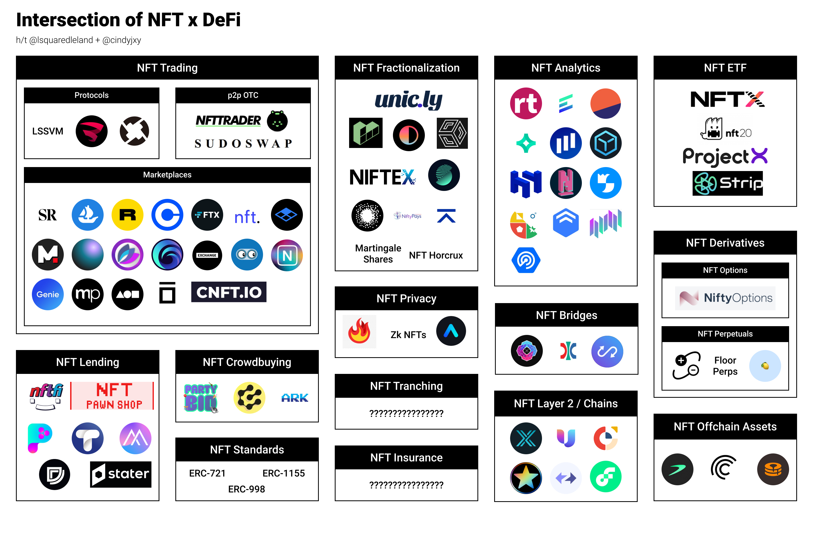

# NFT-DEFI
Large list of NFT DeFi projects, with a questionable taxonomy and grouping

| Category              | Sub Category   | Name              | Twitter          | Link                                                |
|-----------------------|----------------|-------------------|------------------|-----------------------------------------------------|
| NFT Trading           | Centralized    | FTX.US            | @FTX_Official    | https://ftx.com/en/nfts                             |
| NFT Trading           | Centralized    | CNFT              | @CNFT_IO         | https://cnft.io/                                    |
| NFT Trading           | Centralized    | Coinbase          | @Coinbase_NFT    | https://coinbase.com/                               |
| NFT Trading           | Decentralized  | LSSVM             |                  | https://0xmons.xyz/assets/nftamm.pdf                |
| NFT Trading           | Decentralized  | 0x Native         | @0xProject       | https://0x.org/                                     |
| NFT Trading           | Decentralized  | NFT Trader        | @NftTrader       | https://www.nfttrader.io/                           |
| NFT Trading           | Decentralized  | Sudoswap          | @sudoswap        | https://sudoswap.xyz/#/                             |
| NFT Trading           | Decentralized  | Genie             | @genie_xyz       | https://genie.xyz                                   |
| NFT Trading           | Decentralized  | Burnt             | @burntfinance    | https://www.burnt.com/                              |
| NFT Marketplace       |                | Opensea           | @opensea         | https://opensea.io/                                 |
| NFT Marketplace       |                | Rarible           | @rarible         | https://rarible.com/                                |
| NFT Marketplace       |                | SuperRare         | @SuperRare       | https://superrare.com/                              |
| NFT Marketplace       |                | Zora              | @ourZORA         | https://zora.co/                                    |
| NFT Marketplace       |                | Shoyu NFT         | @SHOYU_NFT       | https://www.shoyunft.com/                           |
| NFT Marketplace       |                | Artion            |                  | https://artion.io/                                  |
| NFT Marketplace       |                | Nifty Gateway     | @niftygateway    |  https://niftygateway.com/                          |
| NFT Marketplace       |                | Foundation        | @withFND         |  foundation.app                                     |
| NFT Marketplace       |                | Makersplace       | @makersplaceco   |  https://makersplace.com/                           |
| NFT Marketplace       |                | Mintable          | @mintable_app    |  https://mintable.app/                              |
| NFT Marketplace       |                | Infinity          | @infinitydotxyz  | https://infinity.xyz/                               |
| NFT Marketplace       |                | Solanart          | @SolanartNFT     | https://solanart.io/                                |
| NFT Marketplace       |                | Magic Eden        | @MagicEden_NFT   | https://magiceden.io/                               |
| NFT Marketplace       |                | DigitalEyes       | @digitaleyesnft  | https://digitaleyes.market/                         |
| NFT Marketplace       |                | Solsea            | @SolSeaNFT       | https://solsea.io/                                  |
| NFT Marketplace       |                | Exchange Art      | @exchgart        | https://exchange.art/                               |
| NFT ETF               |                | NFTX              | @NFTX_           | https://nftx.io/                                    |
| NFT ETF               |                | NFT20             | @nft20trades     | https://nft20.io/                                   |
| NFT ETF               |                | Project X         | @ProjectX_NFT    | https://www.projectxnft.com/                        |
| NFT ETF               |                | Strip Finance     | @StripFinance    | https://strip.finance/                              |
| NFT Fractionalization |                | Unicly            | @uniclyNFT       | https://www.unic.ly/                                |
| NFT Fractionalization |                | Fractional        | @fractional_art  | https://fractional.art/                             |
| NFT Fractionalization |                | NIFTEX            | @NIFTEXdotcom    | https://niftex.com/                                 |
| NFT Fractionalization |                | Nonce Finance     | @noncefinance    | https://noncefinance.com/                           |
| NFT Fractionalization |                | Martingale Shares |                  | https://www.paradigm.xyz/2021/09/martingale-shares/ |
| NFT Fractionalization |                | NFT Horcrux       |                  | https://github.com/pringao-chevere/NFT-Horcrux      |
| NFT Fractionalization |                | SZNS              | @sznsNFT         | https://szns.io/                                    |
| NFT Fractionalization |                | Spectre           | @spectrexyz      | https://spectre.xyz/                                |
| NFT Fractionalization |                | FRAKTION          | @fraktion_art    | https://www.fraktion.art/                           |
| NFT Fractionalization |                | Bridgesplit       | @bridgesplit     | https://www.bridgesplit.com/                        |
| NFT Lending           |                | NFTfi             | @nftfi           | https://nftfi.com/                                  |
| NFT Lending           |                | Taker Protocol    | @TakerProtocol   | https://taker.org/                                  |
| NFT Lending           |                | Pawn.fi           | @Pawn_Fi         | https://www.pawn.fi/                                |
| NFT Lending           |                | Stater            | @StaterFinance   | https://stater.co/                                  |
| NFT Lending           |                | Drops             | @dropsnft        | https://drops.co/                                   |
| NFT Lending           |                | Themis            | @OfficialThemis  | https://themis.exchange/                            |
| NFT Lending           |                | NiftyPays         | @Nifty_pays      | https://www.niftypays.com/                          |
| NFT Analytics         |                | Rarity.tool       | @raritytools     | https://rarity.tools/                               |
| NFT Analytics         |                | Evaluate.market   | @EvaluateMarket  | https://evaluate.market                             |
| NFT Analytics         |                | Nansen.ai         | @nansen_ai       | https://www.nansen.ai/                              |
| NFT Analytics         |                | NiftyRiver        | @niftyriverio    | https://www.niftyriver.io/                          |
| NFT Analytics         |                | Icy.tools         | @icy_tools       | https://icy.tools/                                  |
| NFT Analytics         |                | Non Fungible      | @nonfungibles    |  nonfungible.com                                    |
| NFT Analytics         |                | DappRadar         | @DappRadar       |  https://dappradar.com/nft                          |
| NFT Analytics         |                | RankNFT.io        | @ranknftio       |  https://ranknft.io/                                |
| NFT Analytics         |                | NFT stats         | @nft_tracker     | https://www.nft-stats.com/                          |
| NFT Analytics         |                | Dune Analytics    | @DuneAnalytics   | https://dune.xyz/                                   |
| NFT Analytics         |                | Upshot            | @UpshotHQ        | https://upshot.io/                                  |
| NFT Analytics         |                | NFT Price Floor   | @nftpricefloor   | https://nftpricefloor.com/                          |
| NFT Analytics         |                | Solanalysis       | @solanalysis     | https://solanalysis.com/                            |
| NFT Crowdbuying       |                | Ark Gallery       | @arkgalleryDAO   | https://ark.gallery                                 |
| NFT Crowdbuying       |                | PartyBid          | @prtyDAO         | https://www.partybid.app/                           |
| NFT Crowdbuying       |                | Koop              | @koopxyz         |                                                     |
| NFT Derivatives       | NFT Perpetuals | Floor Perps       |                  | https://www.paradigm.xyz/2021/08/floor-perps/       |
| NFT Derivatives       | NFT Perpetuals | Antimatter        | @antimatterdefi  | https://antimatter.finance/                         |
| NFT Derivatives       | NFT Perpetuals | Squeeze Finance   | @SqueezeFinance  |                                                     |
| NFT Derivatives       | NFT Options    | Nifty Options     | @NiftyOptionsOrg | https://niftyoptions.org/                           |
| NFT Chains / L2s      |                | Immutable X       | @Immutable       | https://www.immutable.com/                          |
| NFT Chains / L2s      |                | Anoma             | @anomanetwork    | https://anoma.network/                              |
| NFT Chains / L2s      |                | Unifty            | @unifty_com      | https://unifty.io/                                  |
| NFT Chains / L2s      |                | Stargaze          | @StargazeZone    | https://stargaze.zone/                              |
| NFT Chains / L2s      |                | Flow              | @flow_blockchain | https://www.onflow.org/                             |
| NFT Chains / L2s      |                | zkSync            | @zksync          | https://zksync.io/dev/nfts.html                     |
| Private NFTs          |                | LIT Protocol      | @LitProtocol     | https://litprotocol.com/                            |
| Private NFts          |                | ZK NFTs           |                  | https://github.com/centrifuge/zk-nft-demo-contract  |
| Private NFts          |                | Aleo              | @AleoHQ          | https://aleohq.com                                  |
| NFT Standards         |                | ERC721            |                  |                                                     |
| NFT Standards         |                | ERC1155           |                  |                                                     |
| NFT Standards         |                | ERC998            |                  |                                                     |
| NFT Offchain Assets   |                | Centrifuge        | @centrifuge      | https://centrifuge.io/                              |
| NFT Offchain Assets   |                | Tellor            | @WeAreTellor     | https://www.tellor.io/                              |
| NFT Offchain Assets   |                | Maple             | @maplefinance    | https://www.maple.finance/                          |
| NFT Bridges           |                | Wormhole          | @wormholecrypto  | https://wormholebridge.com/#/                       |
| NFT Bridges           |                | Optics            | @opticsxyz       |                                                     |
| NFT Bridges           |                | Anyswap           | @AnyswapNetwork  | https://anyswap.exchange/                           |
| NFT Insurance         |                |                   |                  |                                                     |
| NFT Tranching         |                |                   |                  |                                                     |

### Taxonomy Definition

* _NFT Trading_ - how users trade NFTs with each other, a mix of p2p and AMM based trading
* _NFT Marketplaces_ - unlike trading, these applications focus on discovery and the creation of NFTs alongside the ability to buy and sell.
* _NFT Fractionalization_ - Converting NFTs into a tokenized representation
* _NFT Lending_ - Borrowing against one’s NFTs and providing liquidity to earn yield
* _NFT ETFs_ - Basket of NFTs and indices of arbitrary NFT collections
* _NFT Perpetuals_ - Instead of trading individual NFTs, now trade a liquid synthetic representation of a collection of NFTs
* _NFT Options_ - The ability to buy or sell an option on an NFT. Sell covered calls for passive income or speculate on the future price with options in a capital efficient manner
* _NFT Crowd Buying_ - Enabling a group of individuals to buy NFTs together
* _NFT Insurance_ - Underwriting the value of an NFT in case a protocol is hacked
* _NFT Chains / L2s_ - Specific chains and L2s that are NFT first
* _NFT Bridges_ - Connecting NFTs with multiple blockchains, potentially moving them to places with more sophisticated auction protocols or more liquid DeFi opportunities.
* _NFT Privacy_ - Making NFTs private, either the data or the ownership
* _NFT Analytics_ - helping people understand the what is happening within an NFT collection

